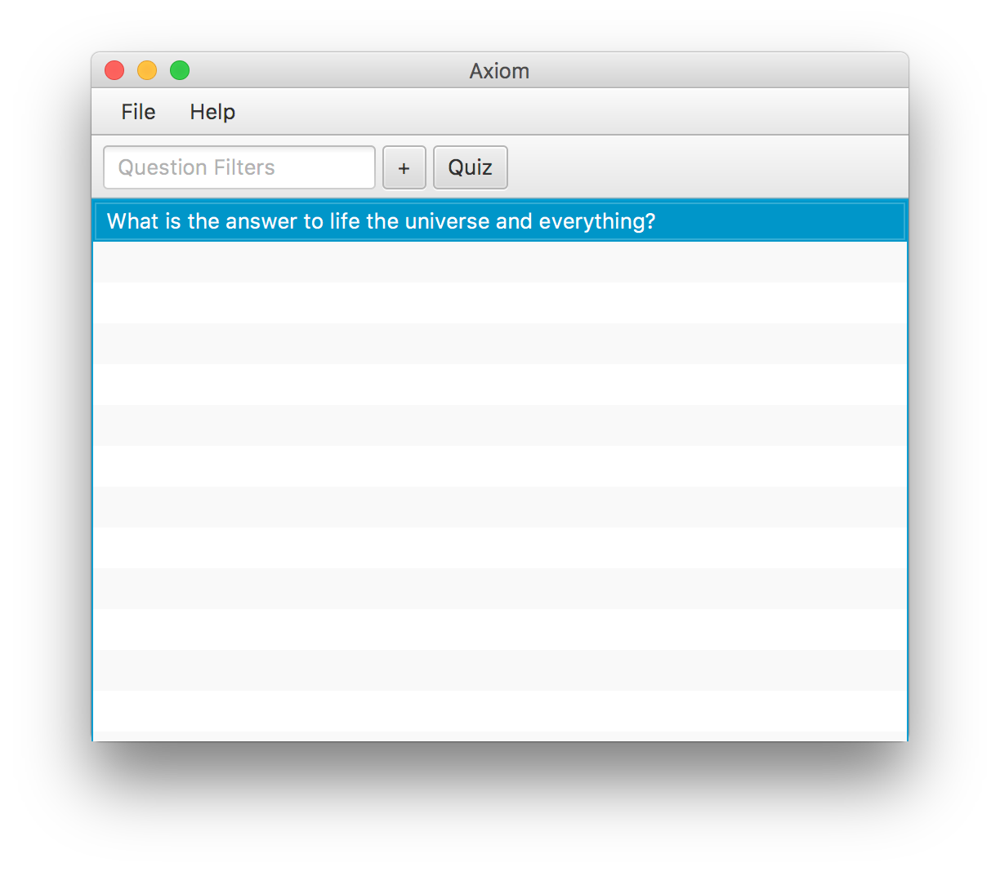

## Compiling

To compile the program, run `make` in the main directory. This will create a jar with all the necessary class files for running the program. Unit tests are run automatically on build. To remove build files run `make clean` in the main directory.

## Running

Once compiled, run `java -jar Axiom` to launch the GUI, or `java -jar Axiom help` to recieve instructions for the command line interface.

## Overview

